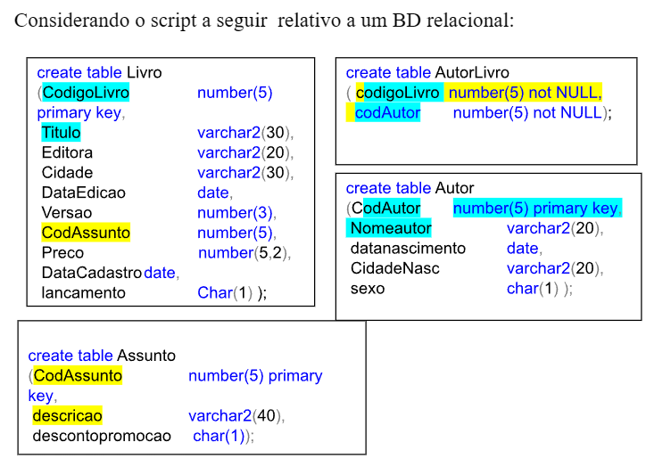

# LISTA 01 - REVISÃO

* Escreva os comandos **SQL** correspondentes às ações/consultas abaixo:

* Analise o modelo e escreva um comando para adicionar a **chave primária** na tabela **AutorLivro** e as **chaves estrangeiras**, considerando que a tabela já está com sua estrutura criada. Usar **Alter Table** e dar nome às **constraints**.

* **Alter table livro**: Adicionar uma nova coluna de nome **Nacionalidade** na tabela **Autor**.

* Escreva os comandos necessários para **incluir 2 linhas** em cada tabela listada acima. A inclusão dos registros de dados deve obedecer a uma **ordem**? Por quê?

* Alterar a coluna **Título** da tabela **Livros** de 30 para 40 posições.

* Incluir uma **restrição de domínio** para a coluna **descontopromocao** da tabela **assunto** de forma a aceitar apenas **‘S’** ou **‘N’**.

* Alterar o campo **editora** da tabela **